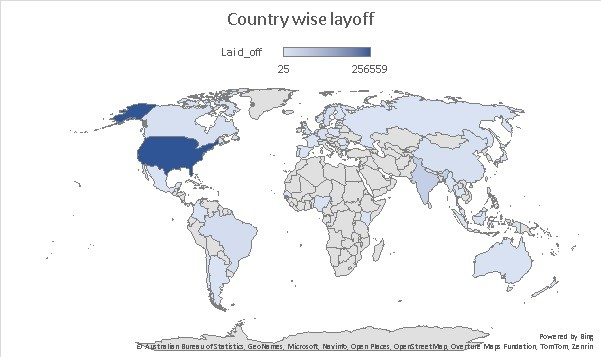
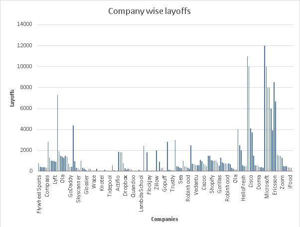
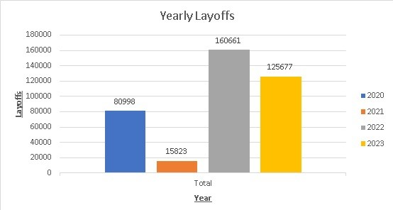
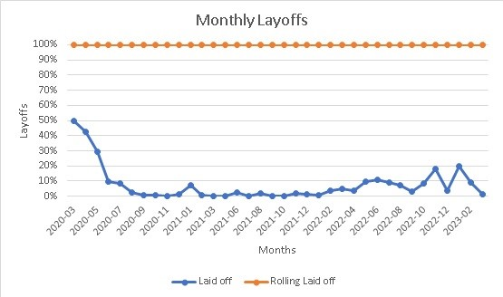

# 🧹 Data Cleaning & Exploratory Data Analysis (EDA) on Global Layoffs Dataset


---

## 📑 Table of Contents
- [Project Overview](#project-overview)
- [Dataset Information](#dataset-information)
- [Data Cleaning Process](#data-cleaning-process)
- [Exploratory Data Analysis (EDA)](#exploratory-data-analysis-eda)
- [Key Insights](#key-insights)
- [Usage](#usage)
- [Example Queries](#example-queries)
- [Repository Structure](#repository-structure)
- [Visualizations](#visualizations)
- [Future Improvements](#future-improvements)
- [Contributing](#contributing)
- [License](#license)
- [Author & Contact](#author--contact)

---

## 📘 Project Overview

This project focuses on **data cleaning and exploratory data analysis (EDA)** of a layoffs dataset covering global companies between **March 2020 – March 2023**.
The raw Excel dataset was imported into **MySQL**, where all cleaning, transformation, and analysis were executed using SQL queries.

---

## 🗂️ Dataset Information

- **Raw file:** `raw_layoffs.xlsx`
- **Imported table:** `layoffs_staging2`
- **Period covered:** 2020-03-11 → 2023-03-06

**Columns:**

| Column                  | Description                                     |
| ----------------------- | ----------------------------------------------- |
| `company`               | Name of the company                             |
| `country`               | Country of operation                            |
| `date`                  | Layoff announcement date                        |
| `sector`                | Industry or business sector                     |
| `total_laid_off`        | Employees laid off                              |
| `percentage_laid_off`   | Workforce percentage affected                   |
| `location`              | Company location                                |
| `stage`                 | Company stage (Startup, Series C, Public, etc.) |
| `funds_raised_millions` | Total funds raised in USD millions              |

---

## 🧽 Data Cleaning Process 

Key cleaning operations performed:

1. Removed null, duplicate, and inconsistent records.
2. Standardized date format (`YYYY-MM-DD`).
3. Trimmed whitespaces and fixed casing for text columns.
4. Replaced blank `percentage_laid_off` with `NULL`.
5. Converted `funds_raised_millions` to numeric data type.
6. Created a **cleaned table** for analysis.

---

## 🔍 Exploratory Data Analysis (EDA)

Executed directly in MySQL using `GROUP BY`, `JOIN`, `WINDOW FUNCTIONS`, and `CTEs` to explore:

* Monthly and yearly layoff trends
* Top companies with highest layoffs
* Layoffs by **country**, **sector**, and **stage**
* Correlation between **funds raised** and **layoffs**
* Average layoff percentage per sector

---

## 📈 Key Insights

* Peak layoffs occurred in **mid-2020** and **early 2023**.
* **Tech** and **consumer-services** sectors were hit hardest.
* Startups in **late-funding stages** had higher layoff rates.
* Some highly funded firms still made massive cuts — funding ≠ stability.

---

## 💻 Usage

### 🔧 Requirements

* **MySQL 8.0+**
* Any SQL client (MySQL Workbench / CLI)
* Raw dataset: `raw_layoffs.xlsx`

### ▶️ Steps to Run

1. **Clone this repository**

    ```bash
    git clone https://github.com/Aadityavarier/Data-Cleaning-and-EDA.git
    ```

2. **Convert Excel file to CSV for MySQL import (if needed)**

    - Open `raw_layoffs.xlsx` and save/export as `raw_layoffs.csv`.

3. **Import the raw dataset into MySQL**

    ```sql
    LOAD DATA INFILE 'path_to/raw_layoffs.csv'
    INTO TABLE layoffs_staging2
    FIELDS TERMINATED BY ',' 
    IGNORE 1 ROWS;
    ```

4. **Run the SQL script**

    ```bash
    mysql -u root -p < "data_cleaning_and_eda_project.sql"
    ```

5. **Explore outputs and insights using SELECT statements.**

---

## 🧾 Example Queries

```sql
-- 1. Top 5 companies with highest layoffs
SELECT company, SUM(total_laid_off) AS total
FROM layoffs_staging2
GROUP BY company
ORDER BY total DESC
LIMIT 5;

-- 2. Monthly layoffs trend
SELECT DATE_FORMAT(date, '%Y-%m') AS month,
       SUM(total_laid_off) AS total
FROM layoffs_staging2
GROUP BY month
ORDER BY month;
```

---

## 🗂️ Repository Structure

```
📁 data-cleaning-and-eda-project/
│
├── 📄 raw_layoffs.xlsx               # Original dataset (Excel)
├── 📄 data_cleaning_and_eda_project.sql  # MySQL cleaning + EDA queries
├── 📄 LICENSE                        # MIT License
└── 📄 README.md                      # Project documentation
```

---

## 📊 Visualizations

> **Below: Chart generated from query outputs. **









**To see more go to ([Visuals](https://github.com/Aadityavarier/Data-Cleaning-and-EDA/tree/main/Visuals))**

---

## 🤝 Contributing

Contributions and suggestions are welcome!

1. Fork the repo.
2. Create a feature branch.
3. Submit a pull request.

---

## 📄 License

This project is licensed under the **MIT License** — see the [LICENSE](LICENSE) file for details.

---

## 👤 Author & Contact

**Aaditya V**  
B.E. in AI & Data Science (2nd Year) — Mumbai University  
- Email: aadityav1703@gmail.com  
- LinkedIn: [aadityavarier](https://www.linkedin.com/in/aaditya-varier-91486b352/)
- GitHub: [Aadityavarier](https://github.com/Aadityavarier)

